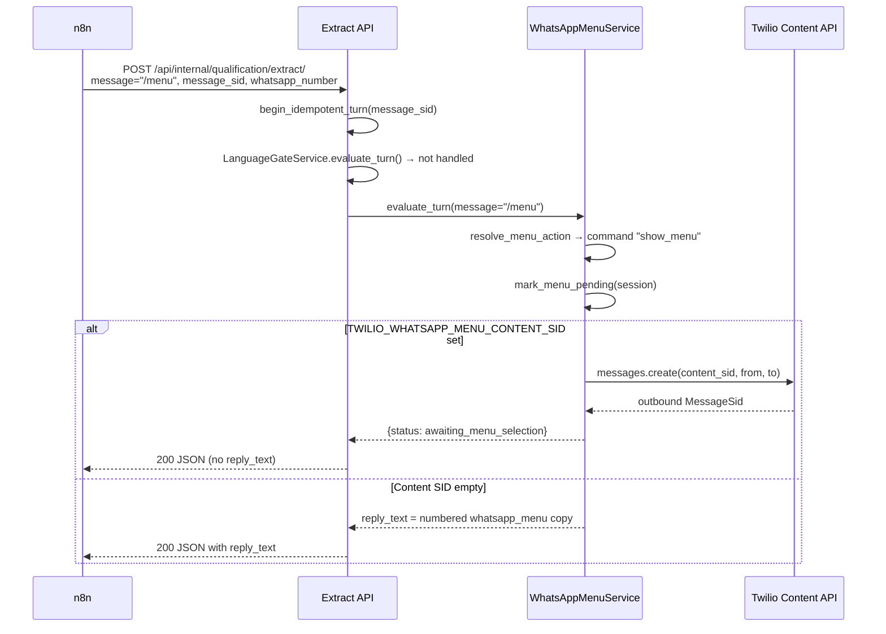
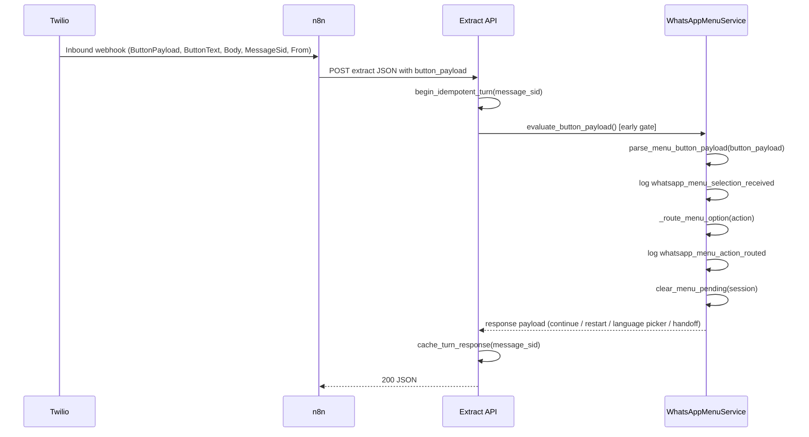

# WhatsApp Clickable Main Menu Verification Report

## Overall Status

**Implemented but unverified**

The Django backend implements Twilio list-picker menu send, inbound payload routing, numeric fallbacks, idempotency, and structured logging. **49 automated tests passed** in this audit environment. Production tap-to-select behavior was **not** verified on a live WhatsApp handset, and **`TWILIO_WHATSAPP_MENU_CONTENT_SID` is empty by default** in test settings and `.env.example`, so live clickable menus depend on Twilio Console template creation and environment configuration.

---

## Executive Summary

Users **can** tap four menu options instead of typing numbers **once** the Twilio list-picker Content Template is created, approved, and its Content SID is set in the environment (`TWILIO_WHATSAPP_MENU_CONTENT_SID` or legacy `TWILIO_MENU_CONTENT_SID`).

When configured, sending `menu` or `/menu` (or hitting the inactivity trigger) causes Django to call Twilio’s Content API with `content_sid=…` and return `{"status":"awaiting_menu_selection","message":"Menu sent."}` so n8n does **not** send a duplicate plain-text numbered menu. Tapping a list item sends `ButtonPayload` values (`menu_continue`, `menu_restart`, `menu_change_language`, `menu_human_handoff`) which are routed **before** the language gate and OpenRouter extraction.

When the Content SID is **not** configured, the system **falls back** to the original plain numbered text menu in `reply_text` — backward compatible, but not clickable.

Typed `1`–`4` still work during the `menu_pending` window (`WHATSAPP_MENU_PENDING_SECONDS`, default 600s).

---

## Implementation Checklist

| Requirement | Status | Evidence | File / Function | Notes |
|---|---|---|---|---|
| `TWILIO_WHATSAPP_MENU_CONTENT_SID` loaded from env | PASS | `config/settings.py` L72–74 | `settings.TWILIO_WHATSAPP_MENU_CONTENT_SID` | Falls back to `TWILIO_MENU_CONTENT_SID` |
| Documented in `.env.example` | PASS | `.env.example` L17–18 | — | Comment describes list-picker SID |
| `TWILIO_WHATSAPP_FROM_NUMBER` wired | PASS | `settings.py` L76; `twilio_whatsapp_menu.py` L52 | `send_whatsapp_main_menu()` | Validated before send |
| `TWILIO_ACCOUNT_SID` / `TWILIO_AUTH_TOKEN` wired | PASS | `settings.py` L65–66; `twilio_whatsapp_menu.py` L50 | `Client(...)` | Validated before send |
| `LEAD_QUALIFICATION_ENABLED` feature flag | PASS | `settings.py` L78; `whatsapp_menu_service.py` L63–66 | `is_lead_qualification_enabled()` | Disabled → menu gates skipped |
| Missing Content SID handled safely | PASS | `twilio_whatsapp_menu.py` L26–31; `whatsapp_menu_service.py` L359–408 | `_validate_send_configuration()`, `_handle_show_menu()` | Missing SID → plain-text fallback; configured-but-missing at send → `TwilioWhatsAppMenuConfigurationError` → HTTP 503 |
| Secrets not logged in menu path | PASS | `whatsapp_menu_logging.py` L14–21 | `log_whatsapp_menu_event()` | Only `message_sid_prefix`, action, channel, error type |
| Uses Twilio client abstraction | PASS | `twilio_whatsapp_menu.py` L50–55 | `send_whatsapp_main_menu()` | Single integration module; no duplicate clients |
| Sends `content_sid` from settings | PASS | `twilio_whatsapp_menu.py` L51–54 | `client.messages.create(content_sid=…)` | Unit test asserts call args |
| Sends from `TWILIO_WHATSAPP_FROM_NUMBER` | PASS | `twilio_whatsapp_menu.py` L52 | `from_=settings.TWILIO_WHATSAPP_FROM_NUMBER` | Tested |
| Sends to normalized WhatsApp address | PASS | `language_gate_service.py` L158–161; `whatsapp_menu_service.py` L360 | `format_whatsapp_recipient_address()` | Prefixes `whatsapp:` when needed |
| No plain numbered menu after successful clickable send | PASS | `whatsapp_menu_service.py` L359–380 | `_handle_show_menu()` | Returns `awaiting_menu_selection` without `reply_text` |
| Twilio API failure handled safely | PARTIAL | `whatsapp_menu_service.py` L315–333; `api/views.py` L160–166 | `_send_clickable_menu()` | Maps to HTTP 502/503; **no integration test** for menu send failure |
| Structured menu logs present | PASS | `whatsapp_menu_service.py` | `log_whatsapp_menu_event()` | All five required event names emitted in code |
| `/menu` triggers clickable menu | PASS | `whatsapp_menu_commands.py` L14–15; tests | `parse_whatsapp_menu_command()`, `test_whatsapp_clickable_menu_inactivity.py` | `/menu` covered in inactivity/restart suites; `menu` in main menu suite |
| Inactivity menu trigger | PASS | `extract_service.py` L135–162; `test_whatsapp_clickable_menu_inactivity.py` | `evaluate_inactivity()` | Clickable when SID configured |
| Menu before language gate / OpenRouter | PASS | `extract_service.py` L188–209, L235–245 | `_try_early_menu_button_gate()`, `_try_menu_gate()` | Button payloads routed first |
| Inbound `MessageSid` captured | PASS | `webhooks/serializers.py` L43; `api/serializers.py` L154–165 | `TwilioInboundSerializer`, `ExtractRequestSerializer` | |
| Inbound `From` captured | PASS | `webhooks/serializers.py` L42, L55–56 | `TwilioInboundSerializer` | Normalized to E.164 |
| Inbound `Body` captured | PASS | `webhooks/serializers.py` L41; `to_extract_request_payload()` L85–91 | — | Mapped to `message` |
| Inbound `ButtonText` captured | PASS | `webhooks/serializers.py` L45, L94 | — | |
| Inbound `ButtonPayload` captured | PASS | `webhooks/serializers.py` L44, L78–80, L93 | — | Stripped; empty → `None` |
| n8n forwards Twilio fields | PARTIAL | `webhooks/n8n_forward.py` L36; `docs/integrations/n8n/LLM-5-django-qualification-endpoint.md` | `forward_to_n8n()` | Django webhook forwards **all** form fields; n8n workflow JSON **not in repo** — contract documented only |
| Button payload prioritized over `Body` | PASS | `extract_service.py` L87–91; `whatsapp_menu_commands.py` L117–119 | Early button gate + `resolve_menu_action()` | List-picker actions do not require `menu_pending` |
| `menu_continue` routing | PASS | `whatsapp_menu_service.py` L514–529 | `_route_menu_option()` | Resumes via `build_qualification_step_response()` |
| `menu_restart` routing | PASS | `whatsapp_menu_service.py` L531–542 | `_handle_restart()` → `restart_qualification_conversation()` | Clears qualification state, keeps language |
| `menu_change_language` routing | PASS | `whatsapp_menu_service.py` L544–553 | `_send_language_picker()` | Sends language picker; returns `awaiting_language_selection` |
| `menu_human_handoff` routing | PASS | `whatsapp_menu_service.py` L555–571 | `mark_session_human_handoff_requested()` | Persists `human_handoff_requested_at` |
| Typed `1`–`4` fallback | PASS | `whatsapp_menu_commands.py` L30–35, L129–132 | `resolve_menu_action()` | Requires `menu_pending` |
| Shared normalized routing layer | PASS | `whatsapp_menu_commands.py` L105–134 | `resolve_menu_action()` | Button + text converge on same option actions |
| MessageSid idempotency | PASS | `extract_service.py` L175–186; `message_idempotency.py` | `begin_idempotent_turn()` | Test: duplicate restart returns identical JSON |
| Unknown payload safe handling | PARTIAL | `whatsapp_menu_service.py` L451–488 | `_handle_unknown_menu_payload()` | Handled **only when `menu_pending`**; outside window may fall through to extraction |
| Feature flag disabled preserves old flow | PASS | `test_whatsapp_clickable_main_menu.py` | `test_feature_flag_disabled_skips_menu_and_uses_normal_flow` | Menu not sent; OpenRouter called |
| Automated test coverage | PASS | 49 tests run, 49 passed | See Test Results | Some edge cases untested (see Gaps) |

---

## Configuration Verification

### Environment variables

| Variable | Source | Test default | `.env.example` | Validation |
|---|---|---|---|---|
| `TWILIO_WHATSAPP_MENU_CONTENT_SID` | `env("TWILIO_WHATSAPP_MENU_CONTENT_SID")` with fallback to `TWILIO_MENU_CONTENT_SID` | `""` (`config/settings_test.py` L33) | L18 | Empty → plain-text menu; send with empty → `TwilioWhatsAppMenuConfigurationError` |
| `TWILIO_WHATSAPP_FROM_NUMBER` | `env(...)` | `whatsapp:+15557654321` | L32 | Required at send time |
| `TWILIO_ACCOUNT_SID` | `env(...)` | Set in test settings | L12 | Required at send time |
| `TWILIO_AUTH_TOKEN` | `env(...)` | Set in test settings | L11 | Required at send time |
| `LEAD_QUALIFICATION_ENABLED` | `env.bool(..., default=True)` | `True` | L20 | When `False`, all menu gates return `handled=False` |

### Settings wiring

```72:78:config/settings.py
TWILIO_WHATSAPP_MENU_CONTENT_SID = (
    env("TWILIO_WHATSAPP_MENU_CONTENT_SID", default="") or TWILIO_MENU_CONTENT_SID
)
TWILIO_WHATSAPP_FROM_NUMBER = env("TWILIO_WHATSAPP_FROM_NUMBER", default="")
LEAD_QUALIFICATION_ENABLED = env.bool("LEAD_QUALIFICATION_ENABLED", default=True)
```

### Feature flag behavior

When `LEAD_QUALIFICATION_ENABLED=False`, `WhatsAppMenuService.evaluate_button_payload()`, `evaluate_turn()`, and `evaluate_inactivity()` all return `handled=False` immediately. `ExtractService` menu gates are skipped; the request proceeds to normal qualification extraction (verified by test).

### Secrets in logs

`log_whatsapp_menu_event()` uses `message_sid_prefix` (first 8 chars only). No auth tokens, full phone numbers, or raw customer message bodies are logged in the menu path. Configuration errors log `error_type` class name only.

**Note:** `LanguageGateService._log_language_gate_event()` still logs full `whatsapp_number` in some language-picker events — outside the menu-specific logger but worth knowing for PII review.

---

## Outbound Menu Flow

Runtime path when a customer sends `/menu` (or `menu`, `start`, `/start`) with language already selected and qualification enabled:



**Key code path:**

1. `ExtractService.run_turn()` — idempotency lookup (`extract_service.py` L175–186)
2. Early button gate skipped (no `button_payload`) — L188–194
3. Language gate (skipped when language already set) — L196–209
4. `WhatsAppMenuService.evaluate_turn()` → `resolve_menu_action` → `_handle_show_menu()` — `whatsapp_menu_service.py` L248–259, L343–408
5. If configured: `send_whatsapp_main_menu(to_number=format_whatsapp_recipient_address(...))` — `twilio_whatsapp_menu.py` L43–56

**Inactivity trigger:** Same `_handle_show_menu()` via `evaluate_inactivity()` when `is_session_inactive()` is true (`WHATSAPP_MENU_INACTIVITY_SECONDS`, default 600).

---

## Inbound Selection Flow

Runtime path when a customer taps a list-picker item:



**Processing order in `ExtractService.run_turn()`:**

1. MessageSid idempotency cache
2. **Early menu button gate** (`button_payload` present) — before language gate
3. Language gate
4. Transcription (voice only)
5. Text menu gate (`menu`, `/menu`, numeric options while `menu_pending`)
6. Inactivity menu gate
7. OpenRouter qualification extraction

Button payloads are **authoritative** and do **not** require the `menu_pending` window (`whatsapp_menu_commands.py` L114–115).

---

## Payload Mapping

| User-visible option | Expected payload | Actual payload (code) | Backend action | Status |
|---|---|---|---|---|
| Continue current conversation | `menu_continue` | `menu_continue` | `continue` → `build_qualification_step_response()` | PASS |
| Restart qualification | `menu_restart` | `menu_restart` | `restart` → `restart_qualification_conversation()` | PASS |
| Change language | `menu_change_language` | `menu_change_language` (+ legacy `menu_language`) | `change_language` → `send_language_picker()` | PASS |
| Talk to human | `menu_human_handoff` | `menu_human_handoff` (+ legacy `menu_human`) | `human_handoff` → `mark_session_human_handoff_requested()` | PASS |

Legacy aliases `menu_language` and `menu_human` remain in `_MENU_BUTTON_PAYLOADS` for backward compatibility (`whatsapp_menu_commands.py` L42–44).

---

## Typed Number Fallback

| Typed input | Expected action | Actual action | Status |
|---|---|---|---|
| `1` | Continue current conversation | `continue` (only if `menu_pending`) | PASS |
| `2` | Restart qualification | `restart` (only if `menu_pending`) | PASS |
| `3` | Change language | `change_language` → language picker | PASS |
| `4` | Talk to human | `human_handoff` | PASS |

Both button payloads and typed numbers route through `resolve_menu_action()` / `_route_menu_option()` — no duplicated action logic.

---

## Idempotency Verification

**Mechanism:** `ExtractService.run_turn()` calls `begin_idempotent_turn(message_sid)` at the start. If the same `MessageSid` was already processed, the cached JSON response is returned immediately without re-running menu actions, restarts, handoffs, or OpenRouter (`extract_service.py` L175–186, `message_idempotency.py` L15–26).

**Persistence:** In tests and dev without Redis, an in-memory backend is used (`QUALIFICATION_REDIS_URL` empty). Production uses Redis `SET NX` with TTL (`persistence/backends.py`).

**Tested:** `test_repeated_message_sid_is_idempotent_for_menu_restart` — duplicate `menu_restart` with same SID returns identical JSON and qualification fields cleared only once.

**Not explicitly tested:** Idempotency for `menu_human_handoff`, `menu_change_language`, or duplicate `/menu` show commands (same mechanism applies by code inspection).

**Human handoff duplicates:** `mark_session_human_handoff_requested()` always sets `human_handoff_requested_at` when reached, but duplicate Twilio deliveries are short-circuited by MessageSid cache before the handler runs again.

---

## Test Results

### Commands executed

```bash
# Focused suite (26 tests)
PYTEST_DISABLE_PLUGIN_AUTOLOAD=1 pytest -p django -p no:launch_testing \
  apps/qualification/tests/test_whatsapp_clickable_main_menu.py \
  apps/qualification/tests/test_twilio_whatsapp_main_menu_config.py \
  apps/qualification/tests/test_whatsapp_menu_commands.py -q

# Broader related suite (23 tests)
PYTEST_DISABLE_PLUGIN_AUTOLOAD=1 pytest -p django -p no:launch_testing \
  apps/qualification/tests/test_whatsapp_clickable_menu_inactivity.py \
  apps/qualification/tests/test_whatsapp_menu_restart_flow.py \
  apps/webhooks/tests/test_twilio_inbound_serializers.py -q
```

**Note:** `-p no:launch_testing` was required in this environment to avoid a conflicting ROS pytest plugin. `-p django` loads pytest-django correctly when autoload is disabled.

### Results

| Suite | Passed | Failed | Skipped |
|---|---|---|---|
| Focused menu suite | 26 | 0 | 0 |
| Broader menu + webhook suite | 23 | 0 | 0 |
| **Total** | **49** | **0** | **0** |

### Coverage vs audit requirements

| Scenario | Test exists | Result |
|---|---|---|
| `/menu` sends Content SID (not plain text) when configured | Yes (`test_menu_command_sends_twilio_content_sid_instead_of_plain_text`; `/menu` in inactivity tests) | PASS |
| `menu_continue` | Yes | PASS |
| `menu_restart` | Yes | PASS |
| `menu_change_language` | Yes | PASS |
| `menu_human_handoff` | Yes | PASS |
| Text fallback `1`–`4` | Yes | PASS |
| Unknown payload handled safely | Yes (while `menu_pending`) | PASS |
| Unknown payload does not call OpenRouter | Yes | PASS |
| Duplicate MessageSid idempotent | Yes (restart only) | PASS |
| Missing Content SID fails safely | Unit test only (`TwilioWhatsAppMenuConfigurationError`) | PARTIAL |
| Feature flag disabled | Yes | PASS |
| Twilio send failure → safe HTTP error | **Not found** | NOT TESTED |
| Structured log event assertions | **Not found** | NOT TESTED |
| Unknown payload **outside** `menu_pending` | **Not found** | NOT TESTED |

---

## Gaps and Risks

1. **Twilio Console dependency (production blocker):** List-picker Content Template must be created, approved, and its `HX…` SID placed in `TWILIO_WHATSAPP_MENU_CONTENT_SID`. Without it, customers still see the **plain numbered text menu**.

2. **n8n forwarding not verified in-repo:** Django’s Twilio webhook forwards raw form fields to n8n (`forward_to_n8n(params)`). The n8n workflow must map `ButtonPayload` → `button_payload` when calling Django. Workflow JSON is documented in `docs/integrations/n8n/LLM-5-django-qualification-endpoint.md` but not present in this repository.

3. **Unknown `ButtonPayload` outside `menu_pending`:** If an unrecognized payload arrives when the menu is not pending, `evaluate_button_payload()` returns `handled=False` and the message may proceed to OpenRouter extraction (`whatsapp_menu_service.py` L143–155). Unlikely with a correct template, but not fully guarded.

4. **Payload case sensitivity:** `parse_menu_button_payload()` strips whitespace but does **not** casefold. `Menu_Continue` would not match.

5. **Twilio send failure leaves `menu_pending` set:** `_handle_show_menu()` calls `mark_menu_pending()` **before** `_send_clickable_menu()`. If Twilio fails, the customer gets HTTP 502/503 but `menu_pending` may already be true without a menu delivered.

6. **No integration test for Twilio menu send failure:** Code maps exceptions to 502/503, but no test asserts HTTP status for menu send errors.

7. **No automated assertions on structured log JSON** for the five `whatsapp_menu_*` events.

8. **Live WhatsApp UX unverified:** Template item titles/descriptions, list-picker rendering, and Twilio/WhatsApp approval status were not tested on a real device in this audit.

9. **Invalid Content SID at runtime:** Only discovered when Twilio API rejects the SID (generic exception → 502). No startup validation of SID format.

10. **`human_handoff_requested_at` overwrite:** On first successful handoff the timestamp is set; idempotency prevents retries, but there is no explicit “already handoff requested” short-circuit inside the handler.

---

## Required Twilio Console Configuration

**Yes — the following must be configured manually in Twilio Console before production clickable menus work:**

| Item | Required |
|---|---|
| List Picker Content Template (`twilio/list-picker`) | Yes |
| Content SID (`HX…`) in `TWILIO_WHATSAPP_MENU_CONTENT_SID` | Yes |
| Item titles and descriptions (UX copy) | Yes |
| Item payload IDs (exact match below) | Yes |
| WhatsApp sender (`TWILIO_WHATSAPP_FROM_NUMBER`) approved for Content API | Yes |
| Template WhatsApp approval | Yes |

### Expected template item configuration

| Visible option | Payload |
|---|---|
| Continue current conversation | `menu_continue` |
| Restart qualification | `menu_restart` |
| Change language | `menu_change_language` |
| Talk to human | `menu_human_handoff` |

---

## Manual Verification Steps

1. In Twilio Console → **Messaging → Content Template Builder**, create a **WhatsApp** template of type **`twilio/list-picker`** with four items using the payload IDs in the table above.
2. Wait for WhatsApp template approval.
3. Copy the Content SID (`HX…`) into production `.env` as `TWILIO_WHATSAPP_MENU_CONTENT_SID` (or `TWILIO_MENU_CONTENT_SID`).
4. Set `TWILIO_WHATSAPP_FROM_NUMBER`, `TWILIO_ACCOUNT_SID`, `TWILIO_AUTH_TOKEN`, and `LEAD_QUALIFICATION_ENABLED=true`.
5. Confirm n8n forwards `ButtonPayload`, `ButtonText`, `MessageSid`, `From`, and `Body` to Django’s extract endpoint.
6. From a test WhatsApp number with language already selected, send **`/menu`**.
7. **Expect:** A native list-picker UI (not a numbered text block). Django logs should include `whatsapp_menu_sent`. n8n should receive `status: awaiting_menu_selection` and **not** send `reply_text`.
8. Tap **Continue** → qualification resumes from the next missing field; answers preserved.
9. Send `/menu` again → tap **Restart** → fields cleared; language preserved; `restart_intro` reply.
10. Send `/menu` → tap **Change language** → English/Arabic language picker template arrives; no OpenRouter call.
11. Send `/menu` → tap **Talk to human** → handoff acknowledgement; verify `human_handoff_requested_at` in `WhatsAppConversationSession`.
12. Send `/menu` → type **`2`** instead of tapping → same restart behavior (numeric fallback).
13. Replay the same Twilio `MessageSid` (or wait for Twilio retry) → identical JSON response, no double restart/handoff.

---

## Final Verdict

| Question | Answer |
|---|---|
| Is the feature production-ready? | **Backend code is ready** pending Twilio template + env configuration and n8n `ButtonPayload` forwarding. Live tap UX is **not verified** in this audit. |
| Can users tap options instead of typing numbers? | **Yes, when `TWILIO_WHATSAPP_MENU_CONTENT_SID` is set and the Twilio list-picker template is approved.** Otherwise they still see the plain numbered text menu. |
| What still needs fixing before production? | (1) Create/approve Twilio list-picker template and set Content SID. (2) Verify n8n maps `ButtonPayload` to Django. (3) Manual WhatsApp smoke test. (4) Consider hardening: unknown payload guard outside `menu_pending`, defer `mark_menu_pending` until after successful Twilio send, optional case-insensitive payload matching. (5) Add integration tests for menu Twilio send failure and log assertions. |
